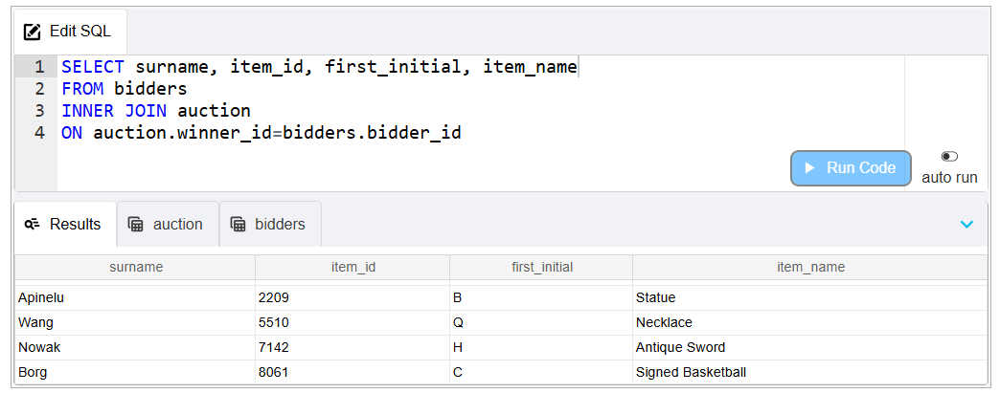
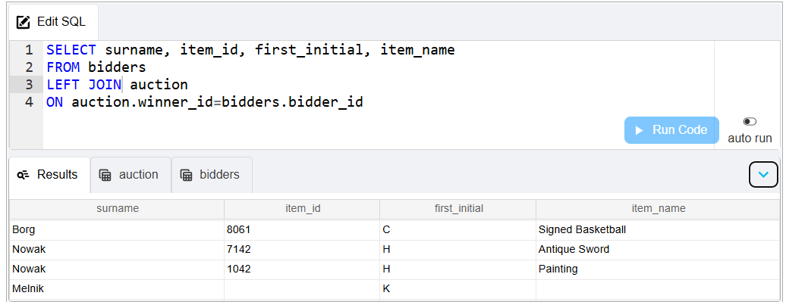
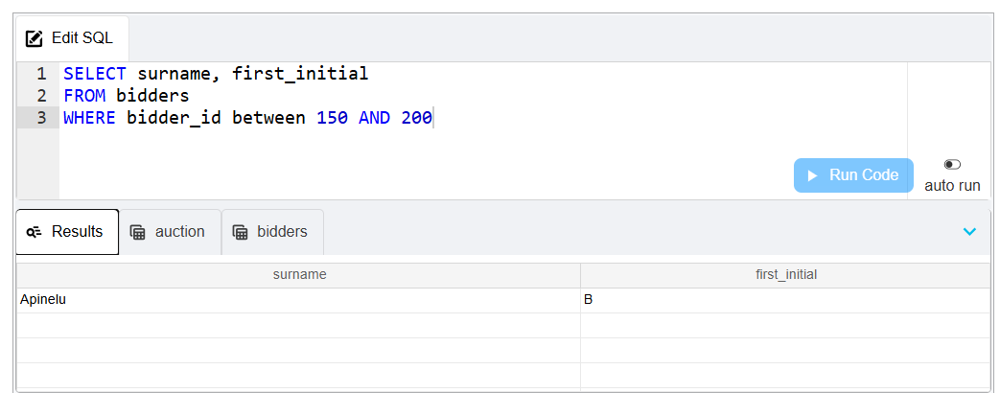
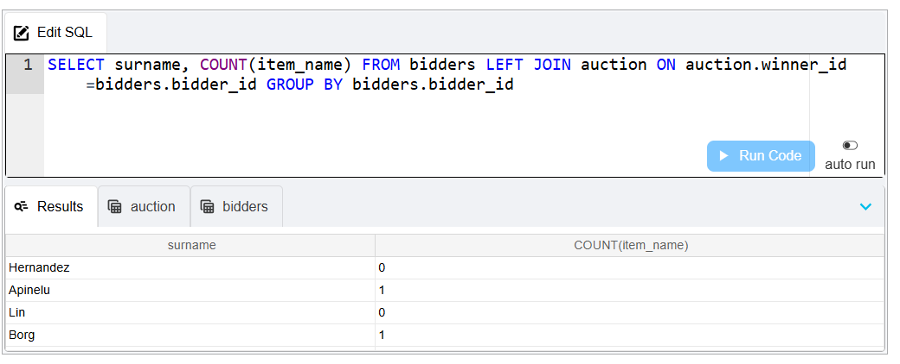

*# 💾 SQL Queries Showcase

This repository contains a collection of **SQL queries** demonstrating my expertise in **data retrieval, manipulation, and database management**.

---

## 📌 **Table of Contents**
- [📌 **Table of Contents**](#-table-of-contents)
- [**Introduction**](#introduction)
- [**Database Schema**](#database-schema)
- [**Screenshots**](#screenshots)
  - [**1. INNER JOIN**](#1-inner-join)
  - [**2. LEFT JOIN**](#2-left-join)
  - [**3. Filtering**](#3-filtering)
  - [**4. GROUP BY**](#4-group-by)

---

## **Introduction**

This project highlights **mySQL** queries written to solve real-world database problems, covering:

- CRUD operations (Create, Read, Update, Delete)
- Joins (INNER, LEFT, RIGHT, FULL)

---

## **Database Schema**
Below is a sample schema used in these queries:

```sql
CREATE TABLE Customers (
    CustomerID INT PRIMARY KEY,
    Name VARCHAR(100),
    Email VARCHAR(100),
    Country VARCHAR(50)
);

CREATE TABLE Orders (
    OrderID INT PRIMARY KEY,
    CustomerID INT,
    OrderDate DATE,
    Amount DECIMAL(10,2),
    FOREIGN KEY (CustomerID) REFERENCES Customers(CustomerID)
);

## **Screenshots**

### **1. INNER JOIN**
> *Query to join `bidder` and `auction` tables on a condition.*


---

### **2. LEFT JOIN**
> *Query left joining `bidder` and `auction` tables on a condition.*


---

### **3. Filtering**
> *Query using `WHERE` and `AND` to filter data.*


---

### **4. GROUP BY**
> *Query grouping results by a column value.*

