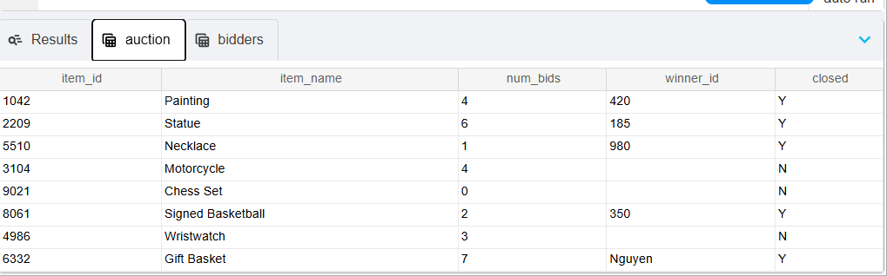
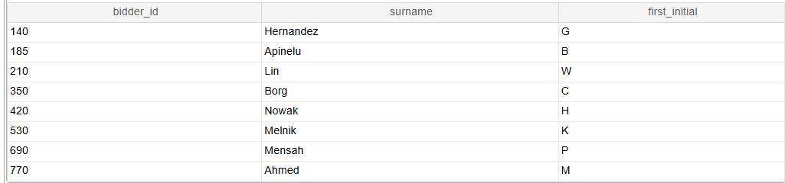

*# 💾 SQL Queries Showcase

This repository contains a collection of **SQL queries** demonstrating my expertise in **data retrieval, manipulation, and database management**.

---

## 📌 **Table of Contents**
- [📌 **Table of Contents**](#-table-of-contents)
- [**Introduction**](#introduction)
- [**Database Schema**](#database-schema)
- [**Screenshots**](#screenshots)
  - [**1. AUCTION TABLE**](#1-auction-table)
  - [**2. BIDDER TABLE**](#2-bidder-table)
  - [**3. INNER JOIN**](#3-inner-join)
  - [**4. LEFT JOIN**](#4-left-join)
  - [**5. Filtering**](#5-filtering)
  - [**6. GROUP BY**](#6-group-by)

---

## **Introduction**

This project highlights **mySQL** queries written to solve real-world database problems, covering:

- CRUD operations (Create, Read, Update, Delete)
- Joins (INNER, LEFT, RIGHT, FULL)

---

## **Database Schema**
Below is a sample schema used in these queries:

```sql
CREATE TABLE auction (
    item_id INT PRIMARY KEY,
    item_name VARCHAR(100),
    num_bids VARCHAR(100),
    winner_id VARCHAR(50),
    closed CHAR(1)
);

CREATE TABLE bidder (
    bidder_id INT PRIMARY KEY,
    surname VARCHAR(100),
    first_initial CHAR(1),
);
 ```

## **Screenshots**

### **1. AUCTION TABLE**



---

### **2. BIDDER TABLE**



---

### **3. INNER JOIN**

> *Query to join `bidder` and `auction` tables on a condition.*


---

### **4. LEFT JOIN**

> *Query left joining `bidder` and `auction` tables on a condition.*


---

### **5. Filtering**

> *Query using `WHERE` and `AND` to filter data.*


---

### **6. GROUP BY**

> *Query grouping results by a column value.*

